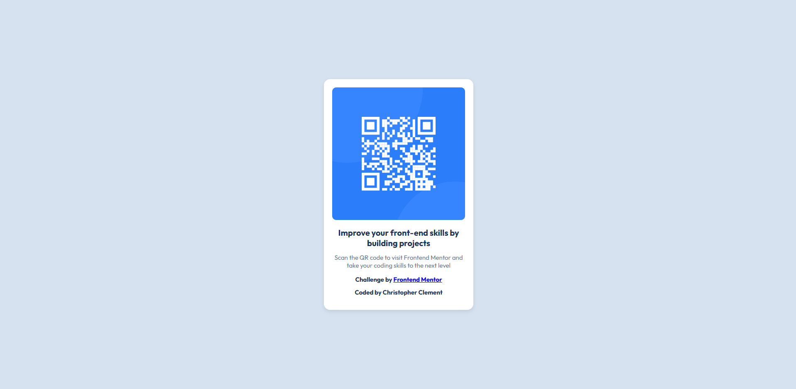
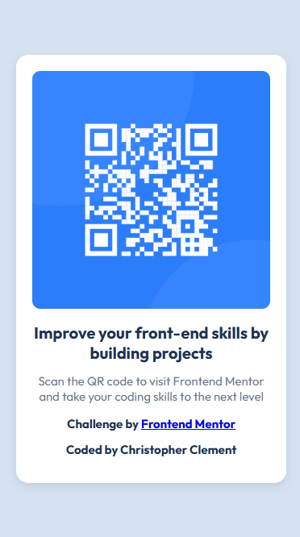

# Frontend Mentor - QR code component solution

This is a solution to the [QR code component challenge on Frontend Mentor](https://www.frontendmentor.io/challenges/qr-code-component-iux_sIO_H). Frontend Mentor challenges help you improve your coding skills by building realistic projects. 

## Table of contents

- [Overview](#overview)
  - [Screenshot](#screenshot)
  - [Links](#links)
- [My process](#my-process)
  - [Built with](#built-with)
  - [What I learned](#what-i-learned)
- [Author](#author)
- [Acknowledgments](#acknowledgments)

## Overview

QR Code Component is a simple frontend project built using HTML and CSS. It displays a visually appealing QR code card, designed to improve UI skills by following best practices in responsive design. This project is part of the Frontend Mentor challenges

### Screenshot

### Links

- Live Site URL:(https://chris619s.github.io/qr-code-component/)

## My process

I started by analyzing the given design and setting up the project structure. Then, I built the HTML layout and styled it using CSS to match the design closely. Finally, I ensured responsiveness and committed my changes to GitHub while managing version control with Git.

### Built with

- Semantic HTML5 markup
- CSS custom properties
- Flexbox
- Mobile-first workflow

### What I learned

Improved my HTML & CSS skills, especially in structuring a clean and reusable component.
Learned how to apply flexbox for centering elements properly.
Gained experience in managing a GitHub repository and handling commits, pushes, and merges.
What challenges did you face, and how did you overcome them?
Faced issues with Git push errors but resolved them by correctly setting up the remote repository.
Had trouble with alignment and spacing in the design, which I fixed using margin and padding.
Initially struggled with matching colors and fonts, but using design references helped.

## Author
- Frontend Mentor - [@chris619s](https://www.frontendmentor.io/profile/chris619s)

## Acknowledgments

I would like to thank **Frontend Mentor** for providing this challenge, which helped me improve my front-end skills.  